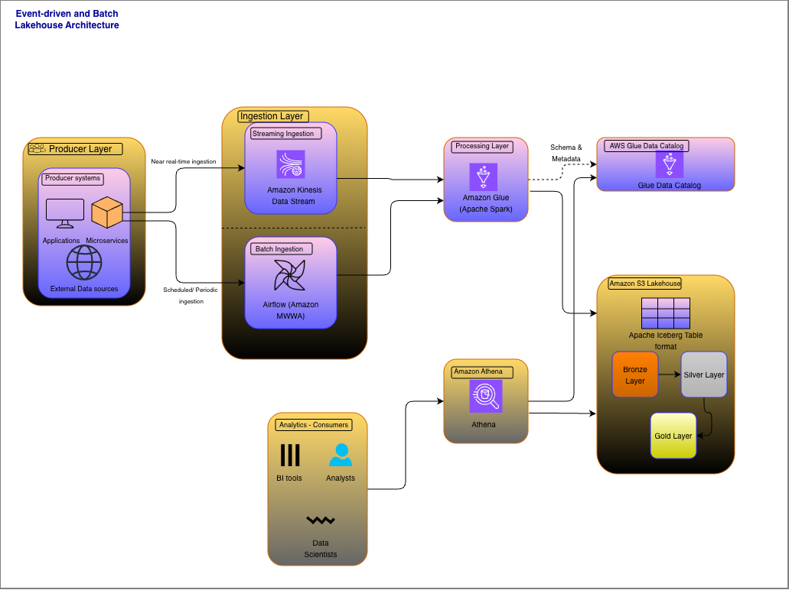

# enterprise-data-platform-aws
A production-grade, event-driven data platform on AWS supporting batch and streaming ingestion, lakehouse storage, governance, and SLAs.

This repository contains the design and implementation of a production-grade enterprise data platform built on AWS.
The platform supports high-volume batch and streaming ingestion, schema-enforced lakehouse storage, data quality guarantees, and operational SLAs, with a strong focus on scalability, reliability, and cost efficiency.

## High-Level Architecture

### Architectural Overview

- **Producers** emit events or files
- **Streaming ingestion** uses Amazon Kinesis
- **Batch ingestion** is orchestrated via Airflow
- **Processing** is handled by AWS Glue (Apache Spark)
- **Storage** follows a Bronze / Silver / Gold lakehouse model on S3
- **Metadata** is managed by AWS Glue Data Catalog
- **Analytics** are served via Amazon Athena

The architecture is intentionally minimal and cloud-native, focusing on
clear separation of concerns and operational simplicity.

---

## Architectural Principles

- Separation of storage and compute
- Immutable raw data
- Contract-first ingestion
- Event-time–driven modeling
- Replayable and idempotent pipelines
- Gold datasets are disposable and rebuildable

Design decisions are documented in detail in
[`architecture/decisions.md`](architecture/decisions.md).

---

## Data Contracts

The platform is built **contract-first**.

### Event Contracts
- Defined as versioned JSON schemas
- Explicit required vs optional fields
- Backward-compatible evolution rules

Example:
contracts/events/order_created_v1.json
### Batch Contracts
- File naming conventions
- Column definitions
- Validation rules

Example:
contracts/batch/partner_daily_snapshot_v1.csv

### SLAs
- Freshness, completeness, and availability expectations
- Separate SLAs for streaming and batch datasets

See:
contracts/slas.md

---

## Data Flow Walkthrough (End-to-End)

### 1. Ingestion (Streaming)

- Producers publish `order_created` events to Amazon Kinesis
- A Glue Spark Structured Streaming job:
    - Enforces the event schema
    - Preserves raw payloads
    - Adds ingestion metadata
    - Writes to the Bronze Iceberg table

Code:
ingestion/streaming/glue_job_order_created.py

---

### 2. Bronze Layer (Raw, Immutable)

- Stores the exact data received from producers
- Partitioned by ingestion time
- Acts as the system of record for replay and audits

Bronze tables are **append-only** and never rewritten.

---

### 3. Bronze → Silver (Correctness Layer)

- Executed as a batch Glue job
- Applies:
    - Deduplication using `event_id`
    - Late data reconciliation
    - Schema normalization

- Uses Iceberg `MERGE` for idempotent upserts

Code:
processing/bronze_to_silver/

---

### 4. Silver Layer (Trusted Data)

- One row per business event
- Enforced contracts
- Event-time–partitioned
- Query-ready for analytics and downstream processing

Silver is the **source of truth** for all downstream consumers.

---

### 5. Silver → Gold (Analytics Layer)

- Aggregates Silver data into business metrics
- Gold datasets are:
    - Consumer-specific
    - Optimized for reads
    - Fully rebuildable

Example Gold table:
- Daily order metrics by date and currency

Code:
processing/silver_to_gold/

---

### 6. Gold Layer (Consumption)

- Served via Amazon Athena
- Supports BI tools and ad-hoc analytics
- Rebuilt deterministically from Silver when logic changes

Gold tables are treated as **products**, not sources of truth.

---

## Monitoring & Observability

The platform uses a **data-driven monitoring approach**.

- Job executions are tracked in metadata tables
- Dataset freshness and volume are queryable via Athena
- Monitoring logic is decoupled from pipelines

See:
monitoring/

This approach provides:
- Auditability
- Consistent observability across jobs
- Easy integration with dashboards or alerting systems

---

## Replay & Backfills

Replayability is a first-class requirement.

### Core Rule
**Bronze data is immutable.**

All reprocessing flows forward:
This approach provides:
- Auditability
- Consistent observability across jobs
- Easy integration with dashboards or alerting systems

---

## Replay & Backfills

Replayability is a first-class requirement.

### Core Rule
**Bronze data is immutable.**

All reprocessing flows forward:
Bronze → Silver → Gold

Supported scenarios:
- Late-arriving data
- Bug fixes in transformations
- Metric definition changes
- Historical backfills

Replay logic reuses canonical jobs and avoids one-off pipelines.

See:
backfills/

---

## Infrastructure

Infrastructure is provisioned using Terraform and includes:
- Amazon S3 lakehouse storage
- Glue Data Catalog databases
- Amazon Kinesis Data Streams
- IAM roles for Glue

See:
terraform/

Infrastructure is intentionally provisioned **before pipelines** to reflect
real-world platform development practices.

---

## Repository Structure
enterprise-data-platform-aws/
├── architecture/
├── contracts/
├── terraform/
├── ingestion/
├── processing/
├── monitoring/
├── backfills/
└── docs/

---

## Status

🚧 This repository is built incrementally following a design-first,
contract-driven approach.

The current implementation covers:
- End-to-end ingestion
- Lakehouse modeling
- Transformations
- Monitoring
- Replayability

---

## Why This Repository Exists

This project is intended to demonstrate:
- Platform-level data engineering
- Clear architectural thinking
- Operational ownership
- Trade-off awareness

It mirrors how real enterprise data platforms are designed, built, and evolved.

